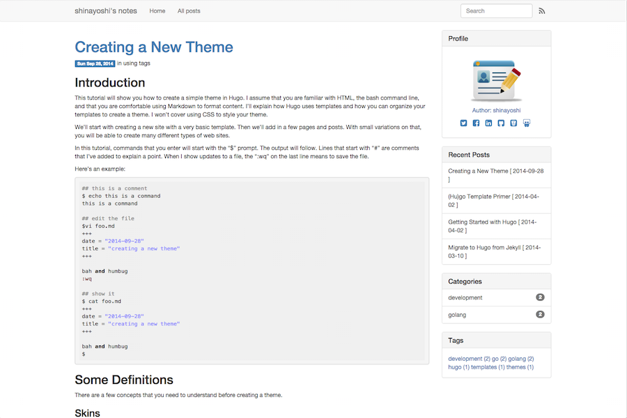

# hugostrap3

## About

hugostrap3 is Hugo theme. This theme is affected by [octostrap3](https://github.com/kAworu/octostrap3).



## Features

* Google Analytics
* Disqus
* Syntax Highlight
* Social Links (Twitter, Facebook, LinkedIn, Github, BitBucket, SlideShare)

## Installation

	$ mkdir themes
	$ cd themes
	$ git clone https://github.com/shinayoshi/hugostrap3

## Usage

	$ hugo server -t hugostrap3 -w -D

## Configuration

### config.toml

```toml:config.toml
theme = "hugostrap3"
baseurl = "http://example.com/"
languageCode = "en-us"
title = "Your blog title"
paginate = 10 # optional
disqusShortname = "Your ID" # optional
copyright = ""

[params]
author = "Your name"
domain = "Your blog domain" # optional
recentLimit = 5 # optional
twitter = "Your ID" # optional
facebook = "Your ID" # optional
linkedin = "Your ID" # optional
github = "Your ID" # optional
bitbucket = "Your ID" # optional
slideshare = "Your ID" # optional
googleAnalyticsUserID = "Your ID" # optional

[permalinks]
post = "/post/:year/:month/:day/:slug/" # optional
```

## License

This theme is released under the MIT license, see [LICENSE.md](LICENSE.md).
